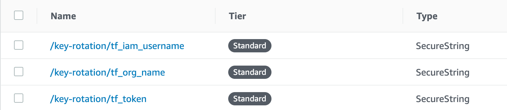
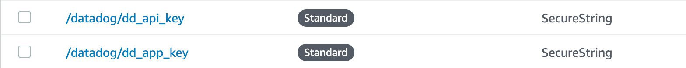

# key-rotation

Dead simple app to rotate AWS security credentials on projects hosted on Terraform Cloud (https://www.hashicorp.com/products/terraform/pricing/).

## Deployment

1. Download the project
2. Create virtual environment: `poetry install`
3. Initialize chalice: `chalice new-project`
4. Replace .chalice/config.json with the following template:

   ```json
   {
     "version": "2.0",
     "app_name": "key-rotation",
     "lambda_memory_size": 128,
     "lambda_timeout": 300,
     "reserved_concurrency": 1,
     "api_gateway_stage": "api",
     "manage_iam_role": false,
     "iam_role_arn": "arn:aws:iam::AWS_ACCOUNT_ID_HERE:role/key-rotation-role",
     "environment_variables": {
       "PYTHONPATH": "./chalicelib:./:$PYTHONPATH",
       "APP_NAME": "key-rotation"
     },
     "subnet_ids": ["SUBNET_1", "SUBNET_2", "...", "SUBENT_N"],
     "security_group_ids": ["SECURITY_GROUP_NAME"],
     "tags": {
       "service_name": "key-rotation",
       "terraform": "false",
       "environment": "prod"
     }
   }
   ```

   NOTE: Chalice does not expand environment variables in its configuration, so they must be
   added explicitly. This is why this configuration must be created manually, as it is
   excluded from the repo in .gitignore.

   Be sure to replace the template placeholders with the values from your environment:

   - AWS_ACCOUNT_ID_HERE
   - SUBNET_1, SUBNET_2, ..., SUBNET_N (minimum of 1 subnet is required)
   - SECURITY_GROUP_NAME

   - The 'tags' block is optional.
   - 'lambda_memory_size' and 'lambda_timeout' can be adjusted as necessary, though the defaults should be suitable for most usages
     <br>

5. Create the IAM role that Lambda function will assume during execution:

   - Run `poetry run python make_role.py` to automatically create the role in your AWS account (requires AWS_ACCESS_KEY_ID and AWS_SECRET_ACCESS_KEY or AWS_PROFILE to be available in your environment variables for boto3.)
     <br>

     -- OR --
     <br>

   - Create the IAM role manually. Below is an example of the permissions created by make_role.py:

     ```json
     {
       "Version": "2012-10-17",
       "Statement": [
         {
           "Effect": "Allow",
           "Action": [
             "ssm:GetParameter*",
             "ssm:Describe*",
             "ssm:List*",
             "ssm:Get*"
           ],
           "Resource": [
             "arn:aws:ssm:*:*:parameter/key-rotation/*",
             "arn:aws:ssm:*:*:parameter/datadog/*"
           ]
         },
         {
           "Effect": "Allow",
           "Action": [
             "kms:ListKeys",
             "kms:ListAliases",
             "kms:Describe*",
             "kms:Decrypt"
           ],
           "Resource": "arn:aws:kms:YOUR_AWS_REGION:YOUR_AWS_ACCOUNT_ID:key/YOUR_KMS_KEY_ID_FOR_PARAMETER_STORE"
         },
         {
           "Effect": "Allow",
           "Action": [
             "logs:CreateLogGroup",
             "logs:CreateLogStream",
             "logs:PutLogEvents"
           ],
           "Resource": "arn:aws:logs:*:*:*"
         },
         {
           "Effect": "Allow",
           "Action": [
             "ec2:CreateNetworkInterface",
             "ec2:DescribeNetworkInterfaces",
             "ec2:DetachNetworkInterface",
             "ec2:DeleteNetworkInterface"
           ],
           "Resource": "*"
         }
       ]
     }
     ```

     If using the above template, be sure to replace the template placeholders with the values relevant to your environment:

     - YOUR_AWS_ACCOUNT_ID
     - YOUR_AWS_REGION
     - YOUR_IAM_USER: the name of the IAM user with permissions to perform actions in your account on behalf of Terraform.
     - YOUR_KMS_KEY_ID_FOR_PARAMETER_STORE: KMS key used to encrypt/decrypt environment variables stored in the AWS Parameter Store.
       <br>

6. The Lambda function looks in the AWS Parameter Store for the sensitive parameters it needs to connect to the Terraform Cloud API. These must be created externally from this project. Create them manually, or manage them using a tool like the excellently crafted Chamber CLI from Segment (https://github.com/segmentio/chamber).
   <br>

   Example:
   

   - Optional: the Lambda will also load your Datadog credentials from Parameter Store, if available, to report execution results to your Datadog account.
     <br>

   Example:
   
   <br>

7. Vendor C depencencies (pandas/numpy): `sh scripts/vendor-c-libs.sh` **(requires Docker)**
   See this article for details: https://medium.com/@qtangs/creating-new-aws-lambda-layer-for-python-pandas-library-348b126e9f3e
   <br>

   scripts/vendor-c-libs.sh

   ```sh
   # https://medium.com/@qtangs/creating-new-aws-lambda-layer-for-python-pandas-library-348b126e9f3e
   export PKG_DIR=vendor
   rm -rf ${PKG_DIR} && mkdir -p ${PKG_DIR}

   docker run --rm -v $(pwd):/foo -w /foo lambci/lambda:build-python3.8 \
       pip install -r vendor-requirements.txt --no-deps -t ${PKG_DIR}

   ```

8. Deploy the function using Chalice: `poetry run chalice deploy`

### Additional Notes

**requirements.txt**: used by Chalice to package the Lambda function

**vendor-requirements.txt**: used by scripts/vendor-c-libs.sh to vendor pandas/numpy prior to Chalice packaging

# TODO

1. post datadog event upon execution
